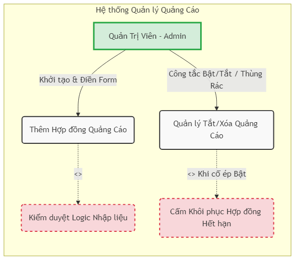

# Chương 9: Mô hình Use Case (Sơ đồ Thị giác)

Bản vẽ UML sơ đồ Use Case dưới đây cung cấp góc nhìn toàn cảnh về bộ 2 chức năng thiết yếu của Admin trong thao tác xử lý Quảng Cáo.

### Chú thích Hoạt động
- **Flow 01 (Thêm Hợp Đồng):** Bao gồm luồng bắt buộc rẽ nhánh (Include) kiểm tra logic ngày tháng hợp lý trước khi chạy tiếp.
- **Flow 02 (Khung công tắc Bật/Tắt và Xóa):** Gắn liền với luồng mở rộng rẽ nhánh ngoại lệ (Extend) trong trường hợp Admin cố nài nỉ Bật công tắc cho một Quảng Cáo vĩnh viễn hết hạn.

### [Ảnh Sơ đồ UML PNG đính kèm]

*(Tệp hình ảnh `usecase-diagram.png` nền trong suốt đã được xuất và lưu trữ gọn gàng trong chung một thư mục. Quét file ném vào slide bài Giảng thuyết trình của bạn).*
